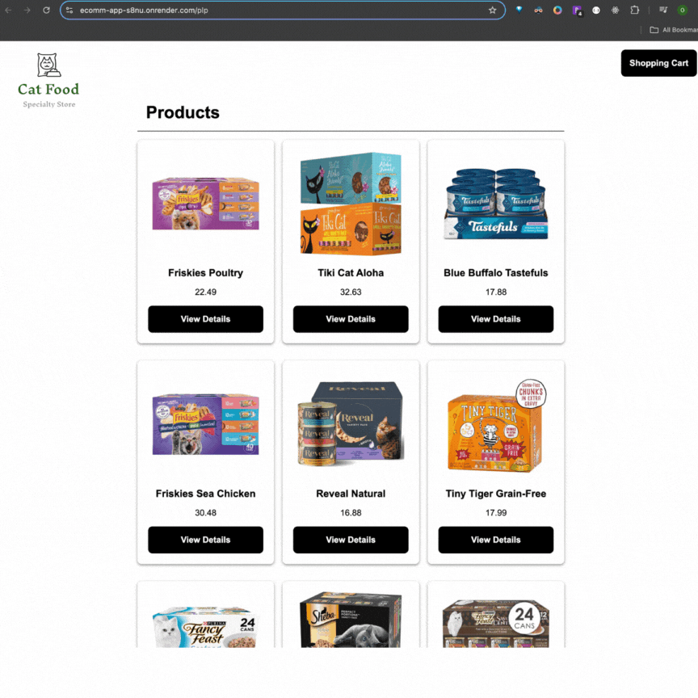

# Cat Food Specialty Store 🛒

A full-stack e-commerce platform for cat food enthusiasts, allowing users to sign in, browse products, and manage their shopping cart.




## Table of Contents
- [Features](#features)
- [Tech Stack](#tech-stack)
- [API Endpoints](#api-endpoints)
- [Getting Started](#getting-started)
- [Future Enhancements](#future-enhancements)

## Features
- User authentication for secure login
- Product catalog with detailed item views
- Cart management for adding and removing items
- Responsive design for mobile and desktop

## Tech Stack
- **Front End**: Vue.js, Axios
- **Back End**: Node.js, Express
- **Database**: MongoDB
- **Authentication**: Firebase Authentication
- **Testing**: Postman

## API Endpoints

### 1. Get All Products
- **Endpoint**: `GET /api/plp`
- **Description**: Retrieves a list of all available products.
- **Response**: Array of product objects.

### 2. Get Product Details
- **Endpoint**: `GET /api/plp/:productId`
- **Description**: Retrieves details of a specific product by ID.
- **Parameters**: 
  - `:productId` - ID of the product.
- **Response**: Product object.

### 3. Get User Cart Items
- **Endpoint**: `GET /api/users/:userId/cartcheckout`
- **Description**: Retrieves the items in the specified user’s cart.
- **Parameters**: 
  - `:userId` - ID of the user.
- **Response**: Array of product objects in the user's cart.

### 4. Add Item to User Cart
- **Endpoint**: `POST /api/users/:userId/cartcheckout`
- **Description**: Adds a product to the specified user’s cart.
- **Parameters**: 
  - `:userId` - ID of the user.
- **Request Body**: 
  ```json
  {
    "id": "productId"
  }
  ```
- **Response**: Array of product objects representing the updated cart.
 
### 5. Remove Item from User Cart
- **Endpoint**: `DELETE /api/users/:userId/cartcheckout/:productId`
- **Description**: Removes a specified product from the user’s cart.
- **Parameters**: 
  - `:userId` - ID of the user.
  - `:productId` - ID of the product to be removed from the cart.
- **Response**: Array of product objects in the updated cart.

## Getting Started

### Install Dependencies

```bash
# Front-end
cd client
npm install

# Back-end
cd ../server
npm install
```
### Environment Variables
Create a .env file in the server directory:
```bash
DB_USERNAME=your_username
DB_PASSWORD=your_password
DB_CLUSTER=your_cluster
DB_NAME=your_database
DB_APPNAME=your_cluster
```
### Running the Application
Start the development server:
```bash
# Front-end
cd client
npm run serve

# Back-end
cd ../server
npm run dev
```
Open your browser and navigate to:
- Frontend: http://localhost:8080
- Backend API: http://localhost:8000

## Future Enhancements

- **Wishlist**: Allow users to save products for future purchases.
- **Product Reviews**: Enable users to leave feedback and rate products.
- **Order Tracking**: Provide users with updates on the status of their orders.
- **Admin Panel**: Implement basic admin controls for managing product listings and user data.


